# EzzyForms – Next.js + HeroUI Form Builder

EzzyForms is a modern, drag-and-drop form builder built with Next.js and [HeroUI](https://heroui.dev/). It allows users to create, preview, and publish beautiful, accessible forms with ease with Rich Analytics.

---

## ✨ UI Elements & Design

EzzyForms leverages HeroUI for a consistent, modern, and accessible user interface. Below is an overview of the main UI elements and design principles:

### 🧩 **Form Elements**
- **Text Input**: Clean, bordered or borderless fields with floating labels and helper text.
- **Textarea**: Resizable, styled for clarity and ease of use.
- **Select Dropdown**: Custom-styled dropdowns with smooth transitions and clear options.
- **Radio Group**: Modern radio buttons with clear selection states.
- **Checkbox Group**: Stylish checkboxes, grouped for multi-select.
- **Date Picker**: Calendar popover with clear date selection.
- **File Upload**: Drag-and-drop area with icon, file size info, and progress feedback.
- **Rating**: Interactive star-based rating with hover and selection effects.
- **Switch**: Toggle switches for boolean settings.
- **Buttons**: Multiple variants (primary, flat, bordered, icon-only) for actions, all with smooth hover/focus states.
- **Tabs**: For switching between properties and settings, with animated cursor and clear active state.
- **Modals**: For previews, confirmations, and alerts, with focus trapping and keyboard accessibility.
- **Tooltips**: For extra info on hover/focus.
- **Badges**: Status indicators (e.g., Draft, Published) with color coding.
- **Cards**: Used for grouping content, with subtle shadows and rounded corners.
- **Theme Selector**: Visual theme cards with color previews, selectable via accessible buttons.
- **Stats & Analytics**: Visual charts, stats cards, and analytics dashboard to view and analyze form responses.

### 🎨 **UI/UX Design Principles**
- **Consistency**: All elements use HeroUI for a unified look and feel.
- **Accessibility**: Keyboard navigation, focus states, ARIA roles, and semantic HTML are prioritized.
- **Responsiveness**: Layouts adapt to all screen sizes, with mobile-friendly touch targets.
- **Feedback**: Actions (save, publish, copy, delete) provide instant visual feedback (spinners, toasts, modals).
- **Minimalism**: Clean, uncluttered layouts with clear hierarchy and spacing.
- **Customization**: Theme selection allows users to personalize the form appearance.

### 🖼️ **Example UI Screenshots**
<!-- UI Screenshots in 2 Columns (500px wide) -->
<table>
  <tr>
    <td>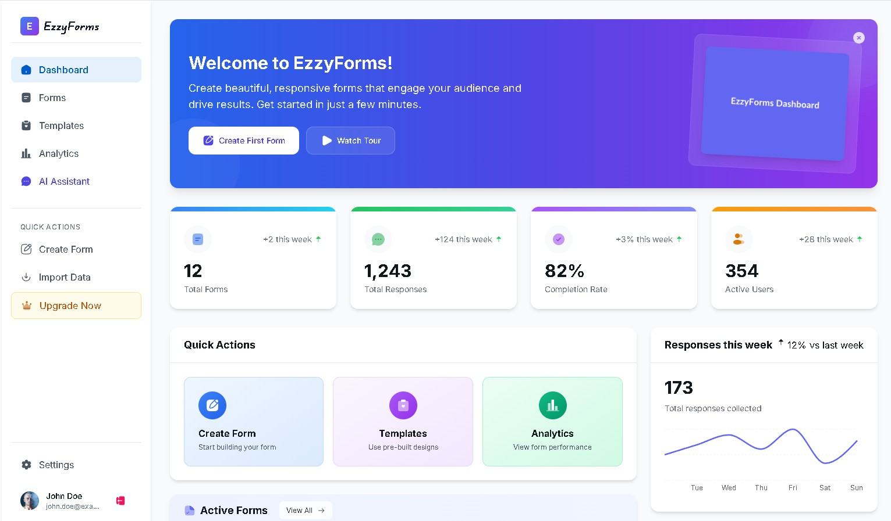</td>
    <td>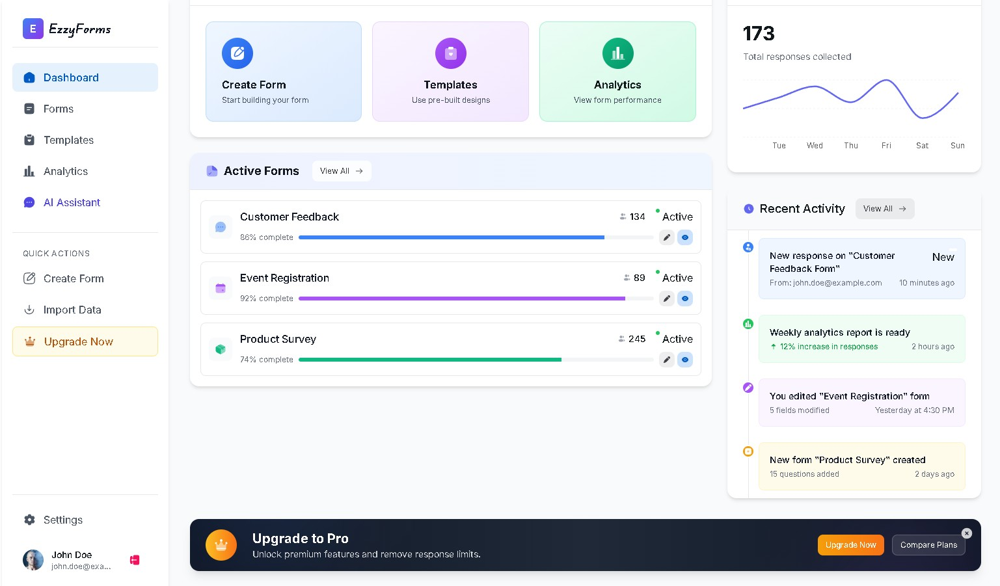</td>
  </tr>
  <tr>
    <td>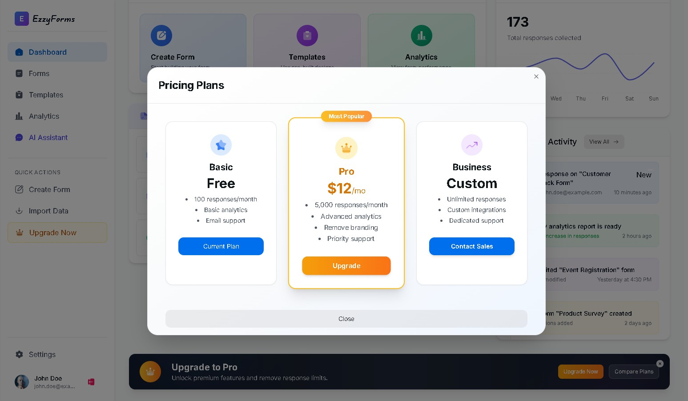</td>
    <td>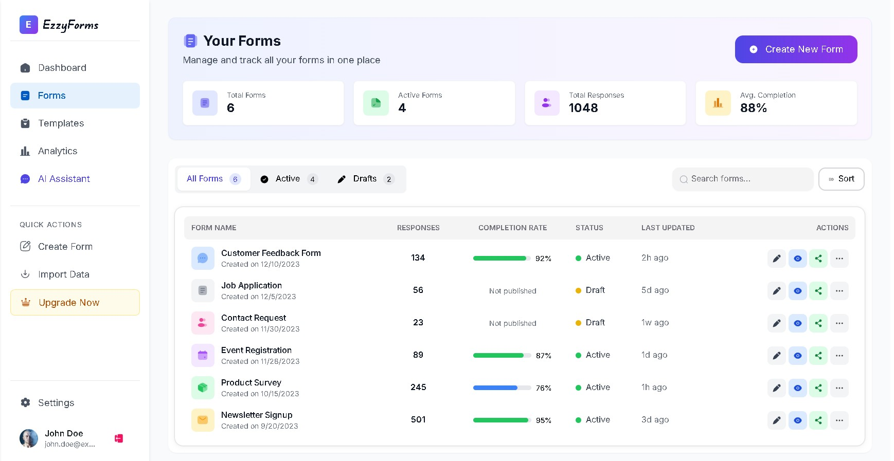</td>
  </tr>
  <tr>
    <td>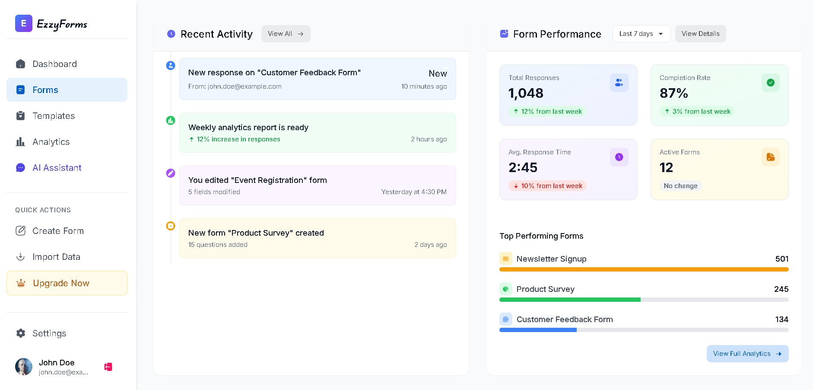</td>
    <td>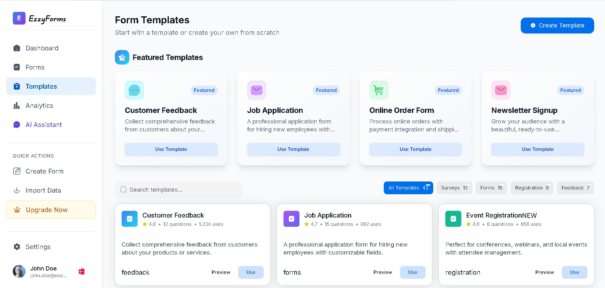</td>
  </tr>
  <tr>
    <td>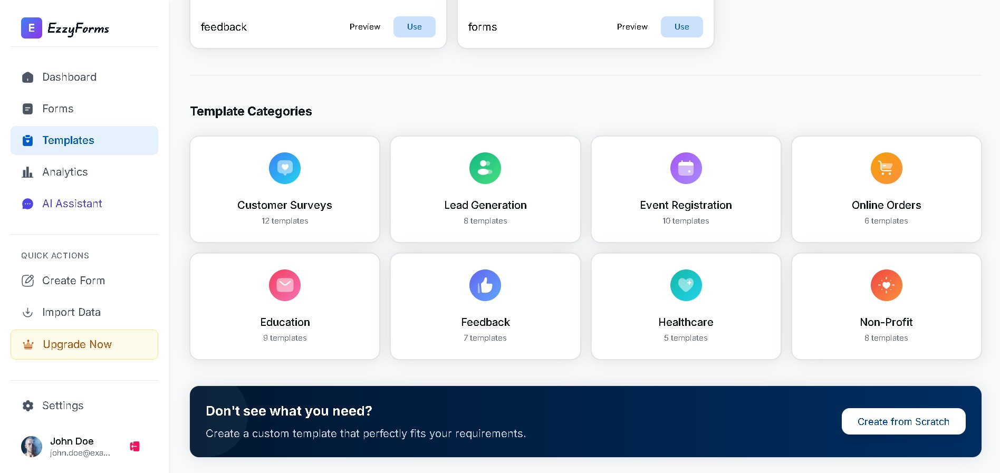</td>
    <td>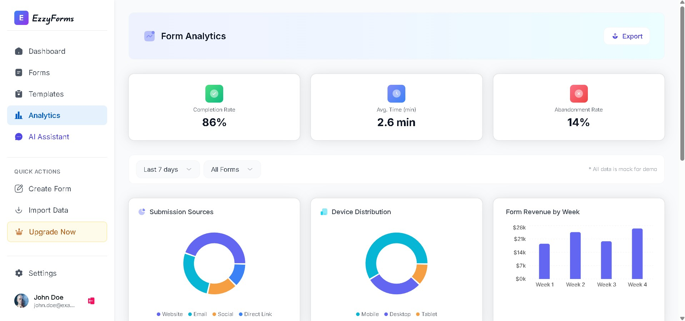</td>
  </tr>
  <tr>
    <td>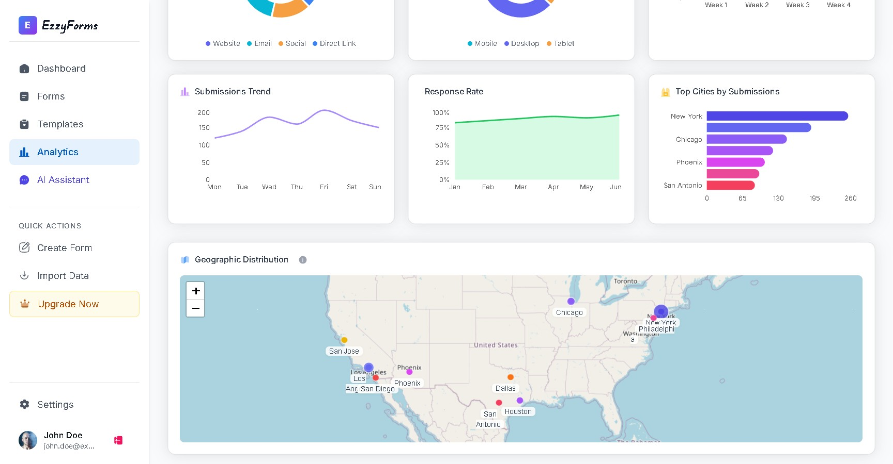</td>
    <td>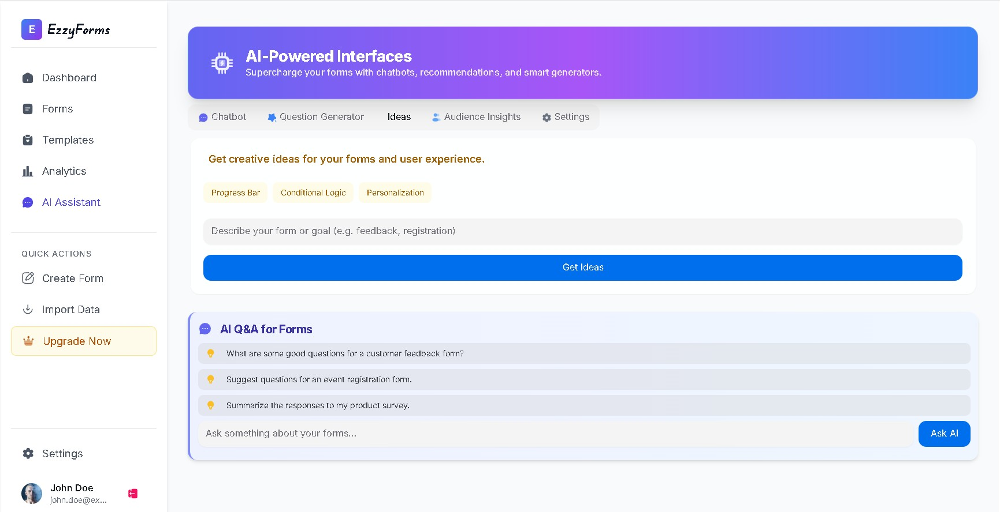</td>
  </tr>
  <tr>
    <td></td>
    <td>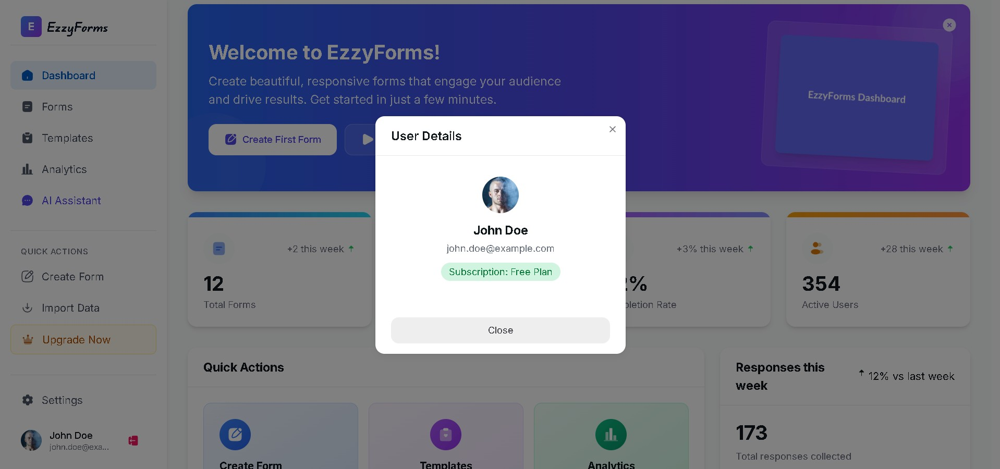</td>
  </tr>
  <tr>
    <td>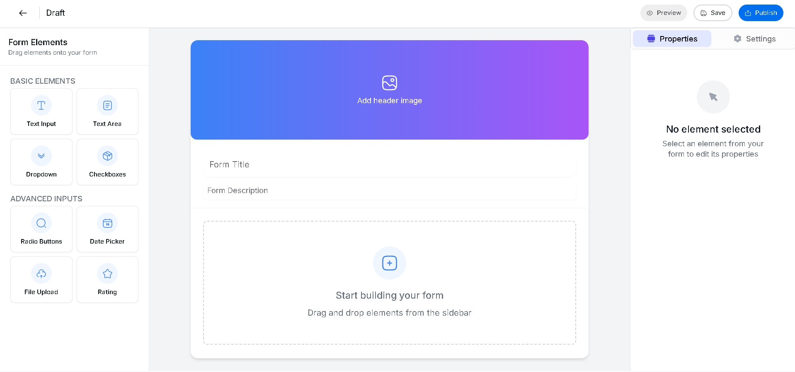</td>
    <td>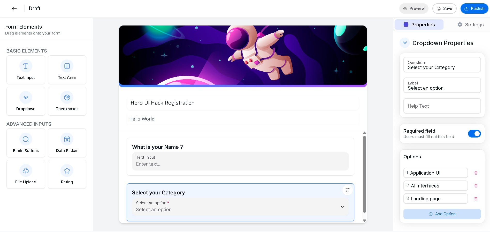</td>
  </tr>
  <tr>
    <td>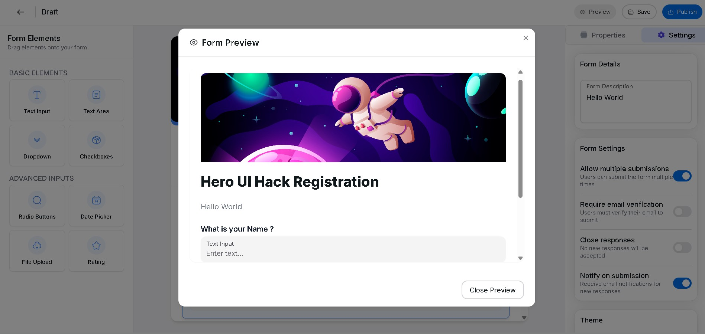</td>
    <td>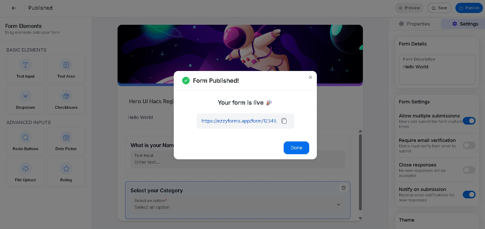</td>
  </tr>
  <tr>
    <td>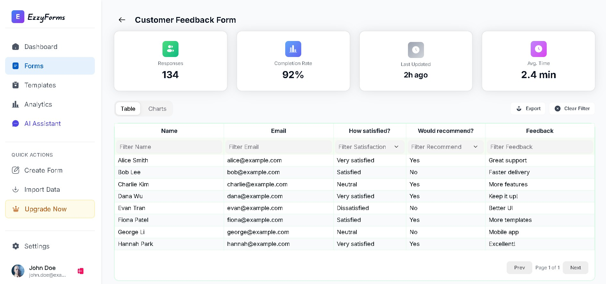</td>
    <td>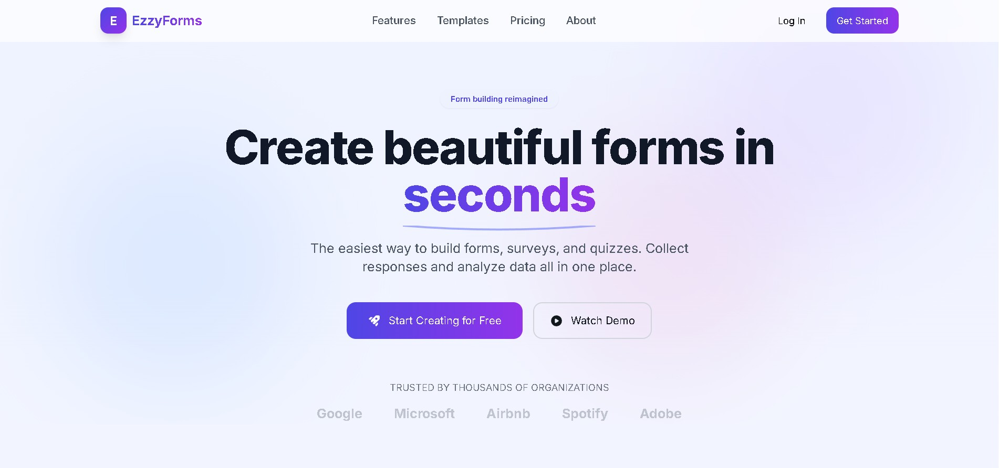</td>
  </tr>
</table>

---

## Features
- **Drag-and-drop form builder**: Add, remove, and reorder form elements interactively
- **Live preview**: Instantly preview your form as you build
- **Customizable themes**: Choose from multiple form themes
- **Rich input types**: Text, textarea, select, radio, checkbox, date, file upload, rating, and more
- **Accessibility**: All interactive elements use HeroUI components for full accessibility compliance
- **Responsive design**: Works great on desktop and mobile
- **Form publishing**: Save and publish forms with shareable links
- **Response analytics**: View statistics and insights for each form, including charts and summary cards for responses

## Tech Stack
- [Next.js](https://nextjs.org/)
- [React](https://react.dev/)
- [HeroUI](https://heroui.dev/) (UI components)
- [Iconify](https://iconify.design/) (icons)
- [ESLint](https://eslint.org/) (linting and accessibility)

## Getting Started

### Prerequisites
- Node.js (v16+ recommended)
- npm or yarn

### Installation
1. **Clone the repository:**
   ```bash
   git clone https://github.com/your-username/ezzyforms.git
   cd ezzyforms
   ```
2. **Install dependencies:**
   ```bash
   npm install
   # or
   yarn install
   ```

### Running the App
```bash
npm run dev
# or
yarn dev
```
Visit [http://localhost:3000](http://localhost:3000) to view the app.

## Linting & Accessibility
- This project uses ESLint with accessibility plugins.
- All interactive elements use HeroUI components to ensure accessibility (keyboard navigation, roles, etc.).
- To run the linter:
  ```bash
  npm run lint
  # or
  yarn lint
  ```

## Folder Structure
- `app/` – Next.js app directory
- `components/` – Reusable UI components
- `public/` – Static assets

## Contributing
1. Fork the repository
2. Create your feature branch (`git checkout -b feature/YourFeature`)
3. Commit your changes (`git commit -am 'Add new feature'`)
4. Push to the branch (`git push origin feature/YourFeature`)
5. Open a pull request

## License
[MIT](LICENSE)

---

**EzzyForms** – Effortless form creation for everyone!
